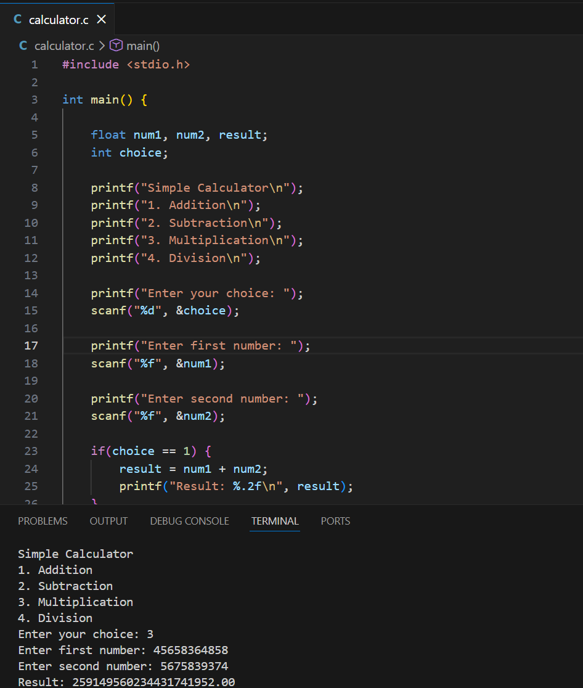

# C Calculator

A simple console-based calculator written in C.

## Features

* Addition
* Subtraction
* Multiplication
* Division

## How to Run

Compile the program:

gcc calculator.c -o calculator

Run the program:

./calculator

## Technologies

C Programming Language

